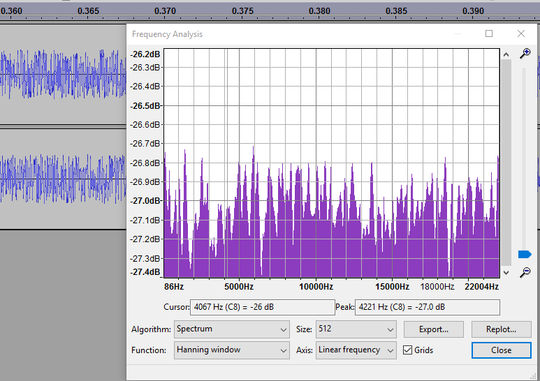
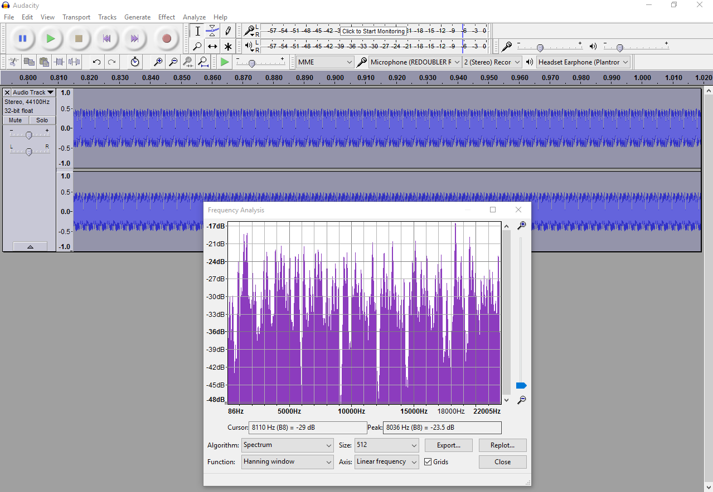
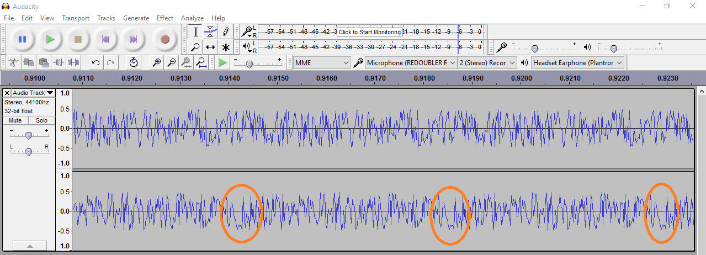

# REDOUBLER-DIY

REDOUBLER is a Random Number Generator based on Modular Entropy Multiplication. It is Open Source Hardware. The device plugs into a host's USB port, and enumerates as a standard microphone. When the microphone is sampled it produces white noise which contains a high proportion of random entropy. The digital data behind that white noise is random numbers, and they can be recorded and used for any purpose that requires a non-deterministic entropy source.  The original designer responsible for REDOUBLER is [Peter Allan](https://github.com/alwynallan).

REDOUBLER-DIY is an easy-to-assemble version of REDOUBLER which requires no custom printed circuit boards or tricky soldering of surface mount devices.   This version starts with a $10  [Cypress CY8CKIT-059](http://www.cypress.com/documentation/development-kitsboards/cy8ckit-059-psoc-5lp-prototyping-kit-onboard-programmer-and)  prototyping kit.   The kit is available direct from Cypress, or through [DigiKey](http://www.digikey.com/product-detail/en/cypress-semiconductor-corp/CY8CKIT-059/428-3390-ND/5184557).   Some other distributors have it available, but are  charging a higher price.  I've added just eight 1% tolerance resistors to the kit in an attempt to duplicate old-style axial resistors needed to complete this design only a few bucks more. (More details below.)   Assembled, my prototype looked like this:

But listening to the "sound" output from my Redoubler, I detected a sort of odd tone to it.   You can find my recordings in the data directory.   I used Audicity to record the data, resetting the board between files.   Analyzing them carefully showed they were periodic, but that is sometimes more obvious than others.        

Here's a time series and frequency analyis of pseudonoise.wav.   This one "sounds" like noise to my ears, but performing a frequency analysis shows there is a repeating pattern to the noise-like data.

Other times after pressing reset it sounded more like a square wave to me.   To my surprise looking at the data, it wasn't even close, but it in this case the repeating pattern is obvious in Audacity:

